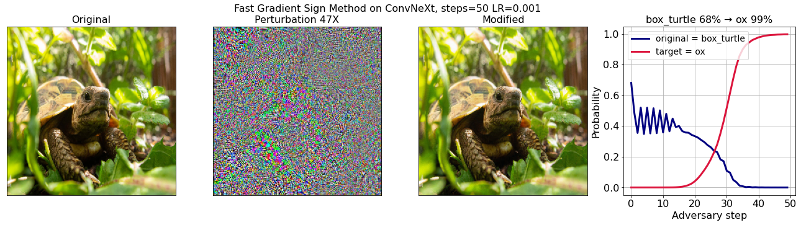

# Adversarial examples to the new ConvNeXt architecture

To get adversarial examples to the ConvNeXt architecture, run the Colab:
https://github.com/stanislavfort/adversaries_to_convnext/blob/main/adversaries_to_ConvNeXt.ipynb

To get more information, read the blog post:
https://stanislavfort.github.io/blog/convnext_adversaries/

The [A ConvNet for the 2020s](https://arxiv.org/abs/2201.03545) paper from Facebook (Meta?) AI Research proposed a new architecture called [*ConvNeXt*](https://github.com/facebookresearch/ConvNeXt) that is built out of standard convolutional blocks and seems to outperform the [Vision Transformer](https://arxiv.org/abs/2010.11929) (ViT). I wanted to know if it suffers from adversarial examples so [I wrote a Colab](https://github.com/stanislavfort/adversaries_to_convnext/blob/main/adversaries_to_ConvNeXt.ipynb) that loads up a pretrained version of the ConvNeXt model, runs a quick loop of the [Fast Gradient Sign Method](https://www.tensorflow.org/tutorials/generative/adversarial_fgsm), and demonstrates that it's easy to find adversaries to this new model. This is not surprising, but I thought it might be valuable to demonstrate it explicitly as well as to create a [Colab](https://github.com/stanislavfort/adversaries_to_convnext/blob/main/adversaries_to_ConvNeXt.ipynb) that others can run and modify for their own experiments.

An example of what you can get from the Colab is this:

I am using the https://github.com/leondgarse/keras_cv_attention_models repository that made the whole process of loading the pretrained model really easy.
